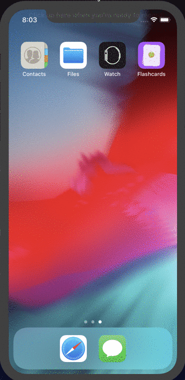
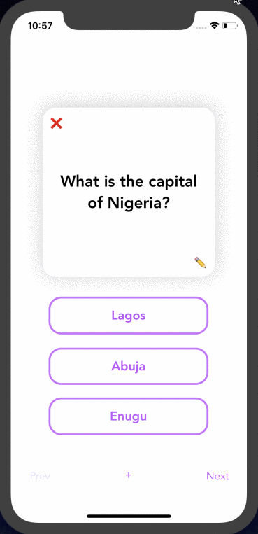

## Flashcard

## Lab 4

### App Description
CodePath Week 8, Lab 4: Flashcard App - Added custom animations and styles for better user experience.

### App Walk-though
 

## Required
- [x] User should see the app icon 
- [x] User should see a splash screen
- [x] User shuold see an flip animation when revealing the answer
- [x] User should see a slide animation when going to the next flashcard
- [x] User should see a slide animation when going to the previous flashcard
- [x] Push code to GitHub
## Optional
- [x] User should see a nicer flaschard with rounded corners, shadows, and animating when showing the first time
- [x] User should see all views properly layout when using the app on a phone of different sizes
- [x] Correct answer in multiple choice should be random

## Lab 3

### App Description
CodePath Week 6, Lab 3: Flashcard App - Allows browse through multiple flashcards, store, edit and delete flashcards.

### App Walk-though
 

## Required
- [x] User can browse through multiple flashcards
- [x] User can re-open the app and see previously created flashcards
- [x] Push code to GitHub
## Optional
- [x] User can delete a flashcard
- [x] User can edit existing flashcard
- [x] User can store multiple choice questions

## Lab 2

### App Description
CodePath Week 4, Lab 2: Flashcard App - Allow users create their own flashcard. Users can edit existing  flashcard. Users can also create multiple choice questions when editing a flashcard. 

### App Walk-though
 

## Required
- [x] User can open the creation screen
- [x] User can cancel out of the creation screen
- [x] User can enter a new question and answer in the creation screen to then show it on the flashcard
- [x] Push code to GitHub
## Optional
- [x] User gets an error if they try to create a new flashcard with no question or answer
- [x] User can edit existing flashcard
- [x] User can add multiple choice answers in the creation screen

## Lab 1
### App Description
CodePath Week 2, Lab 1: Flashcard App - Apps displays a question and on tap displays the answer to the question. Users can toggle the card back and forth. Users can also pick answer from options

### App Walk-though
 

## Required
- [x] Create New Project in Xcode
- [x] Add a view for the front side of the flashcard to display the question
- [x] Add a view for the back side of the flashcard to display the answer
- [x] Build in logic to show the answer side when the card is tapped
- [x] Push code to GitHub
## Optional
- [x] Toggle the flashcard between the question side and the answer side
- [x] Style the question and answer side of the card to better distinguish between the two sides
- [x] Add selectable multiple choice answers beneath the card
